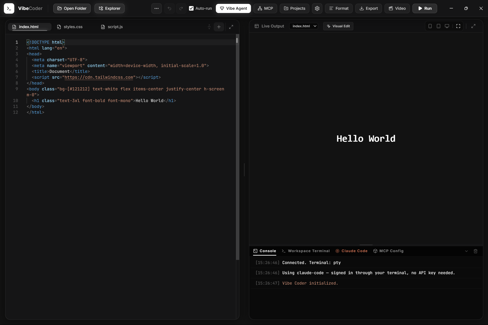
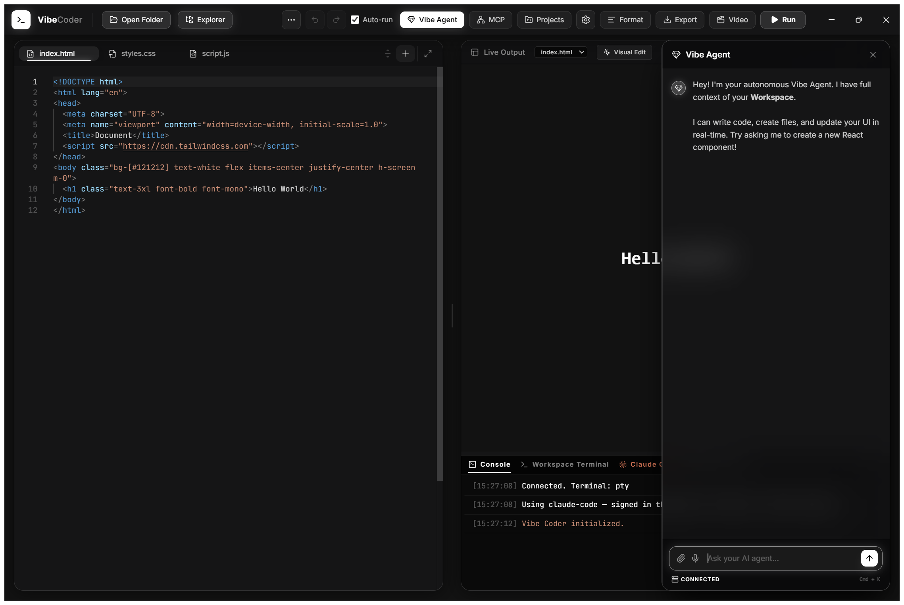
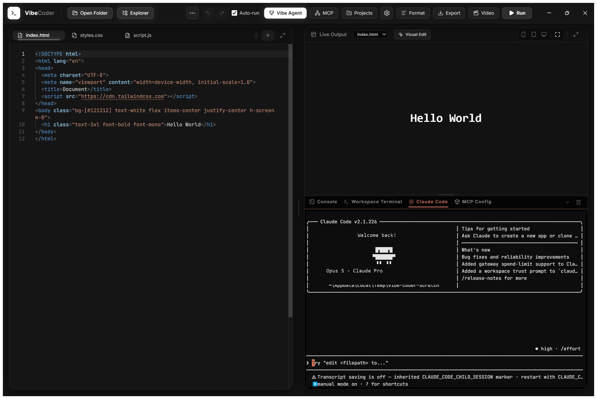

<div align="center">


# Vibe Coder

**An AI coding IDE with a real terminal, real file access, and agents that actually edit your code.**

Write HTML, CSS and JS with a live preview. Talk to an AI agent that reads and
writes the files in front of you. Run a real shell. Use Claude Code, Antigravity,
Codex or a local model — most of them without an API key.

[Download for Windows](../../releases/latest) · [Setup guide](SETUP.md) · [MIT licensed](LICENSE)

</div>

---



## What it is

A desktop IDE built on Electron: a Chromium window for the UI, a Node process
for everything a browser can't do. That's why the terminal is a real terminal
and the agent can actually touch your disk.

- **Live preview** — edit, see it instantly, pick which HTML file renders
- **A real terminal** — a genuine PTY running your shell in the open folder. `npm`, `git`, `node`, full TTY apps
- **Agents that edit files** — seven tools: read, write, edit, delete, search, run commands, download media
- **Projects are folders** — no hidden database; open any folder on your PC
- **Voice input** — dictate prompts, transcribed locally by Whisper
- **Render to video** — turn your page into an MP4 with HyperFrames

### It thinks before it builds

Ask for something real and the agent works out the approach first — reading the
files that matter, deciding what changes where — then builds it. You don't
approve anything; there's no plan to review and no gate to click through. The
thinking runs on a small model with the editing tools withheld, so it costs
very little and physically cannot change a file before it has understood one.

Small asks skip it. Thinking about "make the button blue" is slower than just
doing it.

### It sees what it made

The agent gets a screenshot of the live preview with each message, so it can
look at its own output instead of guessing. When the page throws an error — or
a framework project fails to compile — that lands in its lap too. If a run
leaves the page broken, the errors come back with a button to fix them.

### It doesn't waste your money

Four things keep runs cheap without making them worse: a project map computed
locally so the agent never explores your codebase by reading it, prompt caching
on a byte-stable prefix, old screenshots pruned from history so they aren't
re-billed every turn, and file reads issued in parallel so a batch takes as
long as its slowest read rather than the sum.

## AI providers

Most need **no API key** — they sign in through their own terminal login.

| Provider | Key needed | Notes |
|---|---|---|
| **Claude Code** | No | Signs in with your Anthropic account. Gets its own dedicated terminal tab. |
| **Antigravity** | No | Signs in with your Google account |
| **Codex** | No | Signs in with your OpenAI account |
| **Ollama** | No | Local models — nothing leaves your machine |
| Anthropic / OpenAI / Google | Yes | Paste a key, or keep it in `server/.env` |



The agent panel supports attachments up to 900 MB (large files are staged on
disk and referenced by path, since no model has a 900 MB context), editable
prompts, regenerate, and a resizable panel.

### Claude Code gets its own tab



It's a real PTY, so the full TUI works. Quit it and you're at a normal shell
prompt in the same tab.

## Install

**Download the latest release** and run the installer, or grab the portable zip
and run `Vibe Coder.exe`.

### Windows will warn you. That's expected.

These builds aren't code-signed, so SmartScreen shows a blue *"Windows
protected your PC"* box. Click **More info**, then **Run anyway**.

The warning means "we can't verify who published this", not "this is
dangerous" — an unsigned build from a stranger deserves your suspicion either
way, so the source is all here and you can build it yourself in two commands
below. A signing certificate costs a few hundred dollars a year and these
builds don't have one.

### Build it yourself

```bash
git clone https://github.com/iturnedtoastar/vibe-coder.git
cd vibe-coder
npm install
npm start          # run it
npm run dist       # build installer + portable zip into dist/
```

Requires Node 20+. Everything else is optional.

### Optional tools

Vibe Coder runs with nothing else installed — each tool below just unlocks a
feature, and the app tells you which are missing instead of failing silently.

```powershell
./scripts/setup.ps1        # Windows
bash ./scripts/setup.sh    # macOS / Linux
```

Or hand [`SETUP.md`](SETUP.md) to an AI agent: *"Read SETUP.md and install
everything for me."* There's a Claude Code skill in
[`scripts/vibe-coder-setup/`](scripts/vibe-coder-setup/) for exactly that.

## How it's put together

```
Electron
├── Renderer  ──  vibecoder.html      Monaco, xterm, the agent UI
│                      ▲ │
│           localhost  │ │  HTTP + WebSocket (random port, token-gated)
│                      │ ▼
└── Main      ──  server/             PTY, file tools, agent loop, providers
                       ├──► your shell, in the open folder
                       ├──► your files
                       └──► Anthropic · OpenAI · Gemini · Ollama · agent CLIs
```

| Path | What's in it |
|---|---|
| `vibecoder.html` | The whole UI, one file |
| `server/` | Backend: PTY, sandboxed tools, agent loop, provider adapters |
| `desktop/` | Electron shell |
| `scripts/` | Setup scripts and the setup skill |

## Security

- The backend binds to `127.0.0.1` on a random port and requires a token that's
  regenerated every launch. Nothing is reachable from your network.
- Every path the *model* supplies is resolved against the open folder and
  rejected if it escapes — through `..`, absolute paths, drive letters or
  symlinks. You pick the folder; the agent can't leave it.
- The renderer runs with `contextIsolation` on, `nodeIntegration` off and
  `sandbox` on.
- API keys can live in `server/.env` so they never reach the page.

The sandbox is a **path** boundary, not a container: a command the agent runs
still executes as your user. Set `AGENT_ALLOW_BASH=false` to take `run_command`
away from the agent while keeping your own terminal.

## Contributing

Issues and pull requests welcome. The codebase is plain JavaScript with no build
step for the UI — edit `vibecoder.html` and reload.

## License

MIT — see [LICENSE](LICENSE).

Vibe Coder integrates with, but does not bundle, the following projects:
[Ollama](https://github.com/ollama/ollama) (MIT),
[Whisper](https://github.com/openai/whisper) (MIT),
[yt-dlp](https://github.com/yt-dlp/yt-dlp) (Unlicense),
[HyperFrames](https://github.com/heygen-com/hyperframes) (Apache-2.0),
[video-use](https://github.com/browser-use/video-use) (MIT).
